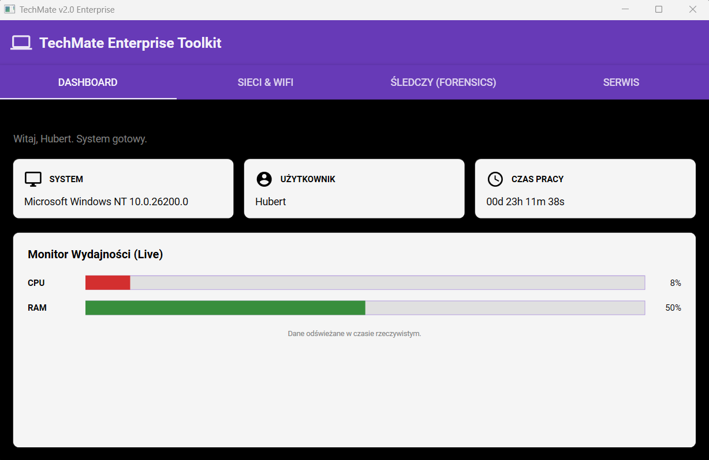

# 💻 TechMate Enterprise Toolkit v2.0

**TechMate** to nowoczesne, wielofunkcyjne narzędzie diagnostyczne dla administratorów IT i specjalistów CyberSecurity, napisane w **C# (WPF)** z wykorzystaniem **.NET 8.0**.

  

## 🔥 Główne Funkcje

### 1. 📊 Dashboard (Centrum Dowodzenia)
* Monitorowanie zużycia **CPU i RAM w czasie rzeczywistym**.
* Informacje o systemie (Wersja OS, Użytkownik).
* Licznik czasu pracy systemu (Uptime).

### 2. 🌐 Sieci & Wi-Fi
* **Wi-Fi Revealer:** Odzyskiwanie zapomnianych haseł do sieci Wi-Fi (wykorzystanie `netsh`).
* **Port Scanner:** Wielowątkowy skaner otwartych portów (TCP).
* **IP Geo:** Sprawdzanie publicznego adresu IP.
* **Network Repair:** Szybkie czyszczenie DNS (`flushdns`).

### 3. 🕵️ Informatyka Śledcza (Forensics)
* **USB History:** Analiza Rejestru Windows w poszukiwaniu śladów podłączanych urządzeń USB.
* **Hosts Inspector:** Weryfikacja pliku `hosts` pod kątem przekierowań (np. przez malware bankowy).

### 4. 🛠️ Serwis
* **Battery Report:** Generowanie oficjalnego raportu kondycji baterii (HTML).
* **Startup Manager:** Podgląd programów uruchamianych ze startem systemu.
* **Disk Cleaner:** Bezpieczne usuwanie plików tymczasowych (TEMP).

## 🚀 Technologie
* **Język:** C#
* **UI:** WPF (Windows Presentation Foundation)
* **Design:** Material Design XAML Toolkit
* **Backend:** System.Management (WMI), Registry Access, Sockets, Async/Await.

---
*Projekt stworzony w celach edukacyjnych.*
